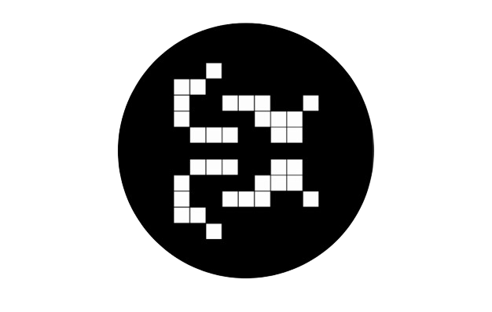

<div align="center"></div>
<h1 align="center">Game of Life</h1>

<div align="center">


<br>


</div>

## Table of Contents
- [Table of Contents](#table-of-contents)
- [📖 About](#-about)
- [🌟 Showcase](#-showcase)
- [✨ Features](#-features)
- [⌨️ Keybindings](#️-keybindings)
- [📦 Structure](#-structure)
- [📚 Libraries](#-libraries)
- [🔧 Build](#-build)
  - [Nix (recommended for MacOS and Linux)](#nix-recommended-for-macos-and-linux)
  - [Windows (WSL)](#windows-wsl)
- [🚀 Releases](#-releases)
- [📜 License](#-license)

## 📖 About

This is a lightweight C/C++ implementation of Conway’s Game of Life, built using SDL and Dear ImGui.

It allows users to create custom patterns and start or pause the simulation at any time. Additional
features include toggling between light and dark modes, displaying or hiding the grid, and adjusting
the simulation speed.

## 🌟 Showcase

<br>
<div align="center">

</div>

## ✨ Features

- **Project**

  - 🔄 **Reproducible**: Built with Nix, this configuration can be effortlessly reproduced on other
    machines, ensuring a consistent setup.

  - 📖 **Documented**: Most of the parts of my configuration files are commented and documented with
    links and explanations if necessary

- **Application**

  - 🖱️ **Interactive pattern editor** Draw your own initial configuration directly on the grid.

  - ▶️ **Start/Stop simulation** Easily control the simulation with play and pause functionality.

  - 🌗 **Light and dark mode support** Switch between light and dark themes for better visibility
    and preference.

  - 🧮 **Grid display toggle** Show or hide the cell grid overlay for a cleaner or more detailed
    view.

  - ⏱️ **Adjustable simulation speed** Speed up or slow down the simulation to observe behavior at
    your own pace.

  - ⚙️ **Built with SDL and Dear ImGui** Uses SDL for rendering and Dear ImGui for a responsive and
    modern GUI.

## ⌨️ Keybindings

| Key Combination | Action                           |
| --------------- | -------------------------------- |
| C               | Switch between Light / Dark mode |
| G               | Show / hide the grid             |
| ESCAPE          | Exit program                     |
| SPACE           | Turn On / Off the simulation     |
| RIGHT CLICK     | Draw cells                       |
| LEFT CLICK      | Remove cells                     |
| BACKSPACE       | Clear the grid                   |
| ARROW RIGHT     | Next simulation step             |
| ARROW LEFT      | Previous simulation step         |
| ARROW UP        | Accelerate simulation            |
| ARROW DOWN      | Slow down simulation             |

## 📦 Structure

- **Directories**

  - [**`src`**](./src/) - Source files (`.cpp`)
  - [**`libs`**](./libs/) - External libraries
  - [**`assets`**](./assets/) - Images, Shaders and other Resources.
  - [**`build`**](./docs/) - CMake build files

- **Files**

  - `flake.nix` - Environment configuration (based on
    [**dev-templates**](https://github.com/the-nix-way/dev-templates))
  - `.envrc` - Used by **direnv** to load **Flakes**
  - `flake.lock` - Used by **Flakes** to version packages
  - `CMakeLists.txt` -  CMake configuration to build the project

## 📚 Libraries

- [**Dear ImGui**](https://github.com/ocornut/imgui) ~ Bloat-free Graphical User interface for C++
  with minimal dependencies
- [**SDL**](https://github.com/libsdl-org/SDL) ~ Simple Directmedia Layer

## 🔧 Build

### Nix (recommended for MacOS and Linux)

> [!NOTE]
>
> I'm using NixOS as my day-to-day OS, and I have found that **Nix** with **Flakes** was the
> simplest and fastest way for me to setup C/C++ project with external libraries.

To build this project, first make sure you have [Nix](https://nixos.org/download/) installed as a
package manager and [direnv](https://direnv.net/) as a shell extension.

Then, configure it to enable [Flakes](https://nixos.wiki/wiki/flakes) according to your setup.

Once you're ready, you can start by cloning this repo

```bash
git clone https://github.com/leoraclet/game-of-life
cd game-fo-life
```

> [!TIP]
>
> Now, **direnv** should load the environment when inside the project directory, if not, try
> ```bash
> direnv allow
> ```

The `flake.nix` file is where the project's environment is defined, and you can see in it that
[CMake](https://cmake.org/) is part of the packages. So, if everything went well, you should be able
to build the project like so

```bash
cmake -B build -S .
cd build
cmake --build .
```

Then, you can run the produced executable in `build` with

```bash
./game-of-life
```

### Windows (WSL)

> [!WARNING]
>
> I have **NOT** tested the building process on Windows, so you're basically on your own for this.

The best solution to build this project on Windows is to use
[WSL](https://learn.microsoft.com/en-us/windows/wsl/install) and follow the
[Nix](#nix-recommended-for-macos-and-linux) way in it.

You can start by installing nix [here](https://nixos.org/download/#nix-install-windows).

## 🚀 Releases

To run the program without editing the source code or building it yourself, go see the
[**Releases**](https://github.com/leoraclet/game-of-life/releases).

## 📜 License

This project is licensed under the MIT License - see the [LICENSE](LICENSE) file for details.